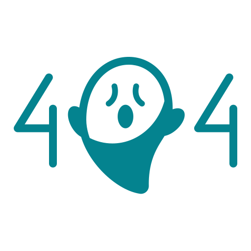

# OlympicGamesApp

This project was generated with [Angular CLI](https://github.com/angular/angular-cli) version 14.1.3.

## Getting Started

Clone the project from the repository
`$ git clone https://github.com/Nogaemi76/OC_P2_angular.git`

Install the node_modules before starting
`$ npm install`

## Development server

Run `ng serve` for a dev server. Navigate to `http://localhost:4200/`. The application will automatically reload if you change any of the source files.

## Build

Run `ng build` to build the project. The build artifacts will be stored in the `dist/` directory.

## Libraries

Chart.js - JavaScript charting library
PrimeNG - Open source native Angular UI components

## Project Description

This project displays informations about the previous olympic games.

It contains 2 main pages (Home and Detail) and a third NotFound page
- page Home: displays a pie chart with Medals per country
- page Detail: displays a line chart with Number of Medals by year for one country
- page NotFound: page 404 with BackHome button

Additional Info included in pages
- page Home: Number of JOs, Number of countries
- page Detail: Number of Entries, Total number of medals, Total number of athletes

Navigation from Home Page to Detail Page is done by click on slice of each country
Navigation from Detail Page to Home Page is done by click on BackHome button

## Authors

[Emilie Nogaro](https://github.com/Nogaemi76)

[dpnick for the starter project](https://github.com/dpnick)

## License

MIT License

Copyright (c) [2023] [Emilie Nogaro]

Permission is hereby granted, free of charge, to any person obtaining a copy
of this software and associated documentation files (the "Software"), to deal
in the Software without restriction, including without limitation the rights
to use, copy, modify, merge, publish, distribute, sublicense, and/or sell
copies of the Software, and to permit persons to whom the Software is
furnished to do so, subject to the following conditions:

The above copyright notice and this permission notice shall be included in all
copies or substantial portions of the Software.

THE SOFTWARE IS PROVIDED "AS IS", WITHOUT WARRANTY OF ANY KIND, EXPRESS OR
IMPLIED, INCLUDING BUT NOT LIMITED TO THE WARRANTIES OF MERCHANTABILITY,
FITNESS FOR A PARTICULAR PURPOSE AND NONINFRINGEMENT. IN NO EVENT SHALL THE
AUTHORS OR COPYRIGHT HOLDERS BE LIABLE FOR ANY CLAIM, DAMAGES OR OTHER
LIABILITY, WHETHER IN AN ACTION OF CONTRACT, TORT OR OTHERWISE, ARISING FROM,
OUT OF OR IN CONNECTION WITH THE SOFTWARE OR THE USE OR OTHER DEALINGS IN THE
SOFTWARE.

## Image credits

All icons are from [Flaticon](https://www.flaticon.com) with Flaticon license
(Free for personal and commercial use with attribution)

<a  href="https://www.flaticon.com/free-icons/home"  title="home icons">Home icons created by Aswell Studio - Flaticon</a>

<a  href="https://www.flaticon.com/free-icons/404-error"  title="404 error icons">404 error icons created by Ghozi Muhtarom - Flaticon</a>
